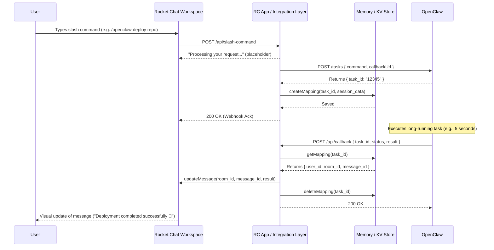

# Async Task Routing Sequence Diagram

```mermaid
sequenceDiagram
    participant User
    participant RocketChat as Rocket.Chat Workspace
    participant App as RC App / Integration Layer
    participant TaskStore as Memory / KV Store
    participant OpenClaw

    User->>RocketChat: Types slash command (e.g. /openclaw deploy repo)
    RocketChat->>App: POST /api/slash-command
    App-->>RocketChat: "Processing your request..." (placeholder)

    App->>OpenClaw: POST /tasks { command, callbackUrl }
    OpenClaw-->>App: Returns { task_id: "12345" }

    App->>TaskStore: createMapping(task_id, session_data)
    TaskStore-->>App: Saved

    App-->>RocketChat: 200 OK (Webhook Ack)

    Note over OpenClaw: Executes long-running task (e.g., 5 seconds)

    OpenClaw->>App: POST /api/callback { task_id, status, result }
    App->>TaskStore: getMapping(task_id)
    TaskStore-->>App: Returns { user_id, room_id, message_id }

    App->>RocketChat: updateMessage(room_id, message_id, result)
    App->>TaskStore: deleteMapping(task_id)

    App-->>OpenClaw: 200 OK
    RocketChat-->>User: Visual update of message ("Deployment completed successfully 🚀")
```
